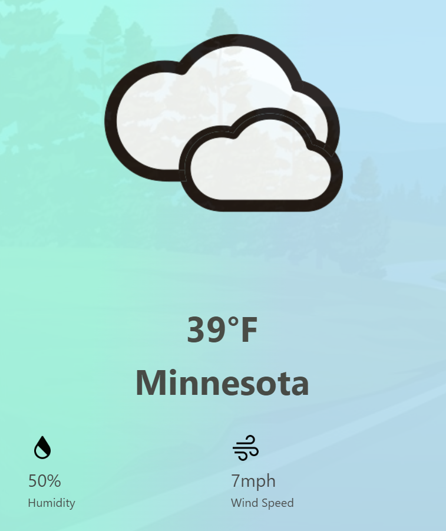

# **HikeME**

Are you ready to go hiking with me?

## **Description**
Hiking website that provides up-to-date weather and trails for a given state.

## **User Story**
*AS AN* avid hiker  
*I WANT* to see nearby trails and the currrent weather  
*SO THAT* I can make an informed choice.  

## **Acceptance Criteria**
*GIVEN* I am looking for places to hike 
*WHEN* I select a state from the dropdown 
*THEN* a selection of all 51 states appear 
*WHEN* I select my desired state 
*THEN* the weather for the state and a map will pop up 

## **Technologies Used**
*APIs Used*
* OpenWeatherMap - https://openweathermap.org/api  
  
* Natoinal Park Service - https://www.nps.gov/subjects/developer/api-documentation.htm  
 

*CSS Framework Used*
* Bulma - https://bulma.io/  

## **Links to HikeME**
* GitHub Repository Link - https://github.com/Romaney-M/HikeME
* GitHub Pages Deployed Link - (please input the link to the GHP)
* Slide Deck Link - https://docs.google.com/presentation/d/1p12NRhaJ1OhBIhtp3gels4SSYc86OzKHFN53Su-5v-8/edit?usp=sharing
## **Authors and Acknowledgement**
Coding With Anxiety (CWA)
* *Lawthoua Xiong* - https://github.com/LawthouaMXiong
* *Romaney MuGoodwin* - https://github.com/Romaney-M
* *Brittany Bowden* - https://github.com/hunsonabadeer45
* *Keleb Aguirre* - https://github.com/KalebAguirre